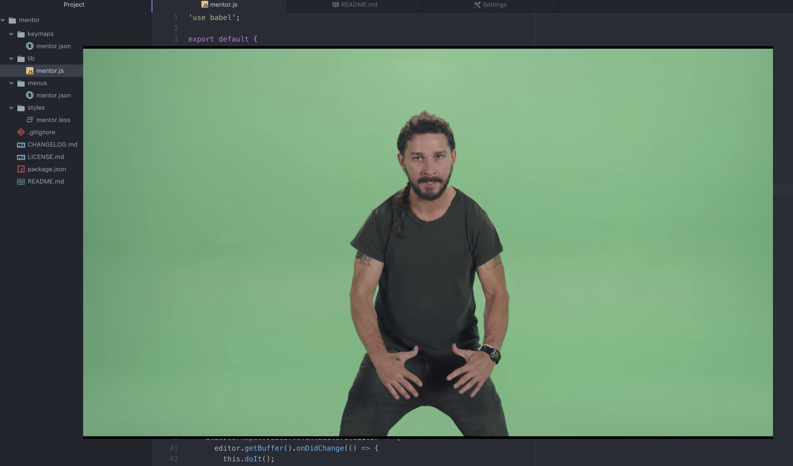

# atom-mentor

When you stop coding, Mentor appears and inspires you in Atom.

If you inspired, click outside of video.

Also, you can change subtitles yourself.

# respect

https://www.youtube.com/watch?v=ZXsQAXx_ao0

https://twitter.com/d151005/status/1144530641599356929

You can change video in configuration.
