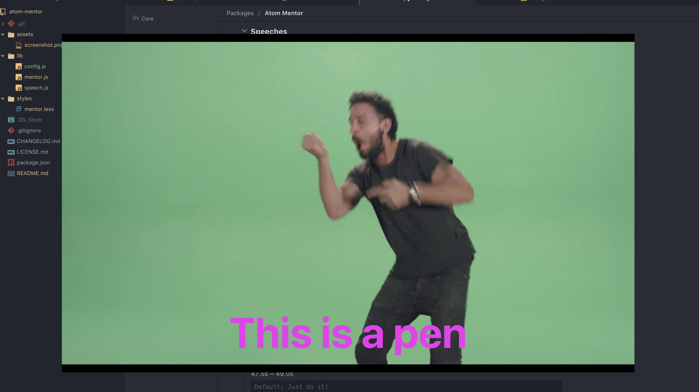

# atom-mentor

When you stop coding, Mentor appears and inspires you in Atom.

If you inspired, click anywhere. Or click outside of vide when you switch off chroma key.

Also, you can change any configuration.

- chroma key
  - enabled
  - color
  - threshold
  - fps
- subtitles
  - enabled
  - text
  - color

# respect

https://www.youtube.com/watch?v=ZXsQAXx_ao0

https://twitter.com/d151005/status/1144530641599356929

You can change video in configuration.
